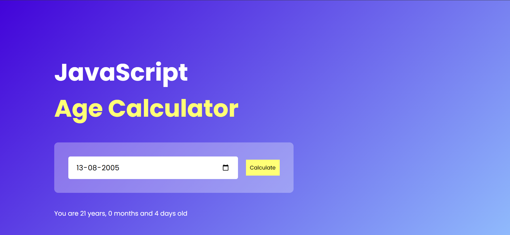

# Age Calculator App

A simple and responsive **Age Calculator** built with HTML, CSS, and JavaScript.

The application allows users to enter their date of birth and calculates their age in **years, months, and days**.

## Features

- Calculate age from date of birth
- Displays age in years, months, and days
- Uses Day.js for accurate date calculations
- Responsive layout for smaller screens
- Clean and simple user interface
- Date input using the browser's built-in date picker

## Technologies Used

- HTML5
- CSS3
- JavaScript
- [Day.js](https://day.js.org/) — JavaScript date manipulation library

## Project Structure

```text
Age-Calculator-App/
│
├── screenshots/
│   └── age-calculator.png
│
├── index.html
├── index.js
├── style.css
└── README.md
```

## How It Works

1. Select your date of birth using the date input.
2. Click the **Calculate** button.
3. JavaScript reads the selected date.
4. Day.js calculates the completed years, remaining months, and remaining days.
5. The calculated age is displayed to the user.

## Example

If the date of birth is:

```text
20-05-2000
```

The application calculates the current age based on today's date and returns a result such as:

```text
26 years, 2 months, 28 days
```

## Screenshots



## How to Run

1. Clone or download this repository.
2. Open the project folder in VS Code.
3. Open `index.html` in your browser.

You can also use the **Live Server** extension in VS Code for a better development experience.

## What I Learned

While building this project, I practiced:

- DOM selection and manipulation
- Event listeners
- Working with input values
- JavaScript functions
- Variable scope
- Date calculations
- Using a third-party JavaScript library
- Responsive CSS with media queries
- Basic project organization

## Future Improvements

- Add validation for future dates
- Improve the mobile UI
- Add more detailed date validation
- Add an option to reset the calculator
- Add animations and improved visual feedback

## Author

**Shivam Bhosale**

This project was created as part of my JavaScript learning journey.
