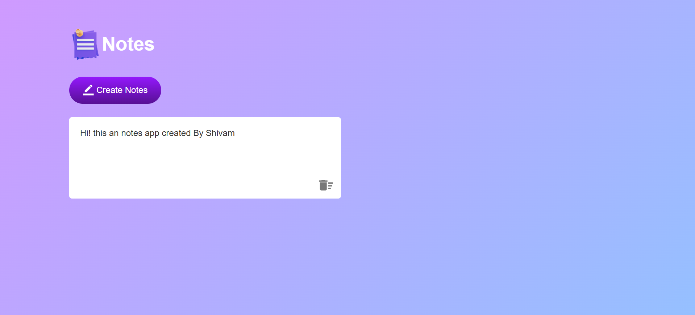

# 📝 Notes App

A simple Notes App built using **HTML, CSS, and JavaScript**.
The app allows users to create, edit, delete, and save notes using the browser's **Local Storage**.

## 📸 Screenshot



## 🚀 Features

* Create new notes
* Edit notes directly in the browser
* Delete individual notes
* Save notes using Local Storage
* Notes remain available after refreshing the page
* Responsive and simple user interface

## 🛠️ Technologies Used

* HTML5
* CSS3
* JavaScript
* Local Storage
* DOM Manipulation

## 📂 Project Structure

```text
Notes-App/
│
├── images/
│   ├── notes.png
│   ├── edit.png
│   └── delete.png
│
├── screenshots/
│   └── notes-app.png
│
├── styles/
│   └── style.css
│
├── scripts/
│   └── script.js
│
├── index.html
└── README.md
```

## 💡 What I Learned

While building this project, I practiced:

* Selecting HTML elements using `querySelector()` and `querySelectorAll()`
* Adding event listeners
* Creating HTML elements dynamically
* Using `innerHTML`
* Using `parentElement`
* Working with `contenteditable`
* Using the `input` event
* Saving and retrieving data with `localStorage`
* Handling dynamically created elements

## ▶️ How to Run

1. Clone or download this repository.
2. Open the project folder.
3. Open `index.html` in your browser.

You can also use **Live Server** in VS Code for development.

## 🔮 Future Improvements

* Add note timestamps
* Add search functionality
* Add dark mode
* Improve mobile responsiveness
* Add confirmation before deleting a note
* Store notes as structured data instead of raw HTML

## 👨‍💻 Author

**Shivam Bhosale**

This project was created as part of my JavaScript learning journey.
