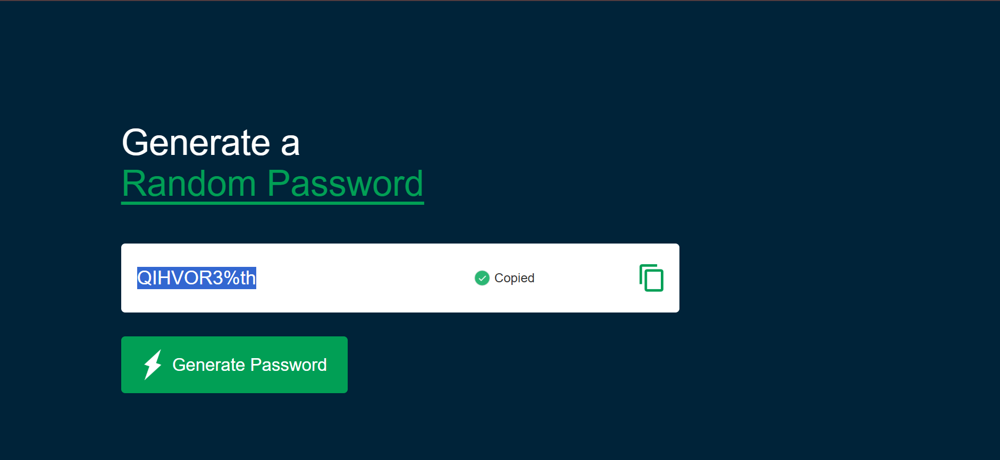

# 🔐 Password Generator

A simple and responsive **Random Password Generator** built using **HTML, CSS, and JavaScript**.

This project generates a random password containing uppercase letters, lowercase letters, numbers, and special characters. It also includes a copy-to-clipboard feature.

## 🚀 Features

* Generate random passwords
* Password length of 10 characters
* Includes:

  * Uppercase letters
  * Lowercase letters
  * Numbers
  * Special characters
* Copy generated password to clipboard
* Displays a "Copied" message after copying
* Simple and clean user interface

## 🛠️ Technologies Used

* **HTML5** – Page structure
* **CSS3** – Styling and layout
* **JavaScript** – Password generation and clipboard functionality

## 📂 Project Structure

```text
Password-Generator/
│
├── index.html
│
├── Screenshots/
│   └── main-page.png
├── styles/
│   └── style.css
├── scripts/
│   └── index.js
│
└── images/
    ├── copy.png
    ├── checkmark.png
    └── generate.png
```

## ⚙️ How It Works

The password generator uses a character set containing:

```text
ABCDEFGHIJKLMNOPQRSTUVWXYZ
abcdefghijklmnopqrstuvwxyz
0123456789
!@#$%^&*
```

JavaScript randomly selects characters from this set until a password of the required length is created.

The generated password is then displayed inside the password input field.

The copy button uses the browser's **Clipboard API** to copy the generated password.

## 📸 Screenshot



## 🧠 What I Learned

While building this project, I practiced:

* DOM manipulation
* `querySelector()`
* Event listeners
* JavaScript functions
* Function parameters and return values
* `for` loops
* `Math.random()`
* `Math.floor()`
* String indexing
* String concatenation
* `setTimeout()`
* `classList.add()` and `classList.remove()`
* Clipboard API
* Connecting HTML, CSS, and JavaScript

## 📸 Project Preview

Add a screenshot of your project here:

```markdown

```

## ▶️ How to Run

1. Clone the repository:

```bash
git clone https://github.com/your-username/password-generator.git
```

2. Open the project folder.

3. Open `index.html` in your browser.

Or use **VS Code Live Server** to run the project.

## 🔮 Future Improvements

Possible improvements for future versions:

* Add a password length slider
* Allow users to choose character types
* Add uppercase/lowercase/number/symbol toggles
* Add password strength indicator
* Add password history
* Improve mobile responsiveness

## 👨‍💻 Author

**Shivam Bhosale**

This project was built as part of my journey learning **JavaScript and Web Development**.

---

⭐ If you found this project useful, consider giving the repository a star!
