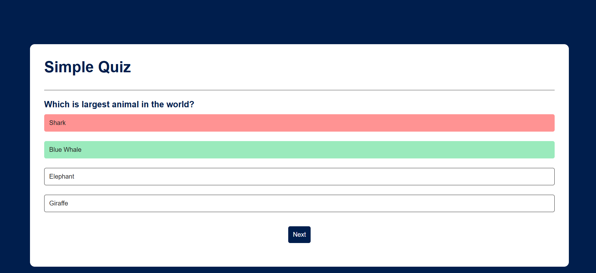

# 🧠 Simple Quiz App

A simple interactive quiz application built using **HTML, CSS, and JavaScript**. The app displays multiple-choice questions, checks the selected answer, highlights correct and incorrect answers, and allows the user to move through the quiz.

## 🚀 Features

* Multiple-choice quiz questions
* Dynamically displays questions and answers
* Detects whether the selected answer is correct
* Highlights:

  * 🟢 Correct answers in green
  * 🔴 Incorrect answers in red
* Reveals the correct answer when a wrong option is selected
* Disables answer buttons after selection
* Next button to move between questions
* Responsive and simple user interface

## 🛠️ Technologies Used

* **HTML5** – Structure of the application
* **CSS3** – Styling and layout
* **JavaScript (ES6)** – Quiz logic and DOM manipulation
* **JavaScript Modules** – Separating question data from application logic

## 📂 Project Structure

```text
quiz-app/
│
├── index.html
│
├── styles/
│   └── style.css
│
├── scripts/
│   ├── index.js
│   └── question.js
│
└── README.md
```

## ⚙️ How It Works

The questions and their answers are stored as JavaScript objects:

```javascript
{
  question: "Which is largest animal in the world?",
  answer: [
    { text: "Shark", correct: false },
    { text: "Blue Whale", correct: true },
    { text: "Elephant", correct: false },
    { text: "Giraffe", correct: false }
  ]
}
```

The application keeps track of the current question using an index:

```javascript
let currentQuestionIndex = 0;
```

When the user selects an answer, the application checks the `correct` property.

* If the answer is correct → the option turns **green**
* If the answer is incorrect → the option turns **red**
* The correct answer is then revealed in **green**
* All answer buttons are disabled after selection

## 🎯 What I Learned

While building this project, I practiced:

* Working with arrays and objects
* `forEach()` and `find()`
* JavaScript functions and parameters
* DOM manipulation
* `createElement()`
* Event listeners
* `classList`
* Dynamic rendering
* JavaScript ES6 modules
* Managing application state with variables
* Conditional logic
* CSS pseudo-classes such as `:hover` and `:disabled`

## 📸 Screenshot




## ▶️ How to Run

1. Clone the repository:

```bash
git clone <your-repository-url>
```

2. Open the project in VS Code.

3. Run `index.html` using **Live Server**.

4. Start answering the questions.

## 🔮 Future Improvements

Some features I plan to add:

* [ ] Score tracking
* [ ] Display final score
* [ ] Restart quiz button
* [ ] Question counter
* [ ] Timer
* [ ] More questions
* [ ] Randomized questions
* [ ] Randomized answer options
* [ ] Better mobile responsiveness

## 👨‍💻 Author

**Shivam Bhosale**

This project was created as part of my JavaScript learning journey while practicing DOM manipulation, events, arrays, objects, and dynamic web applications.
